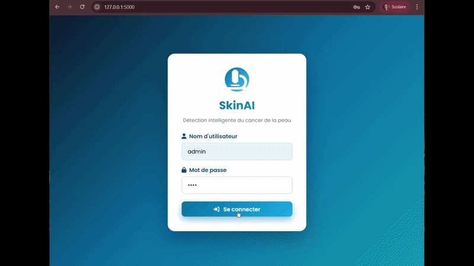
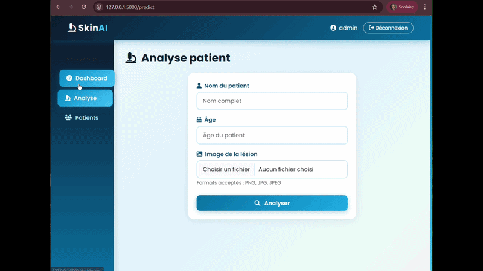
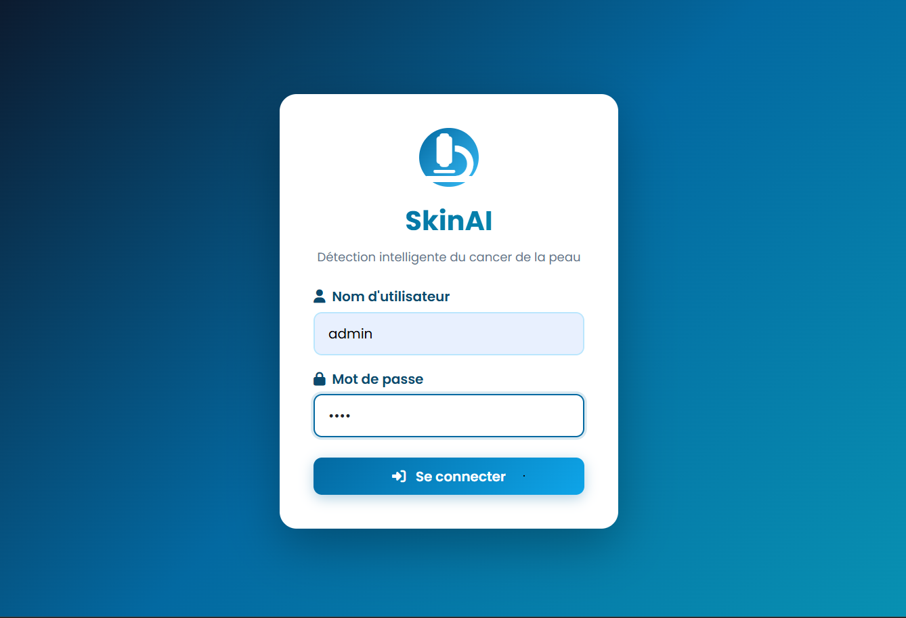
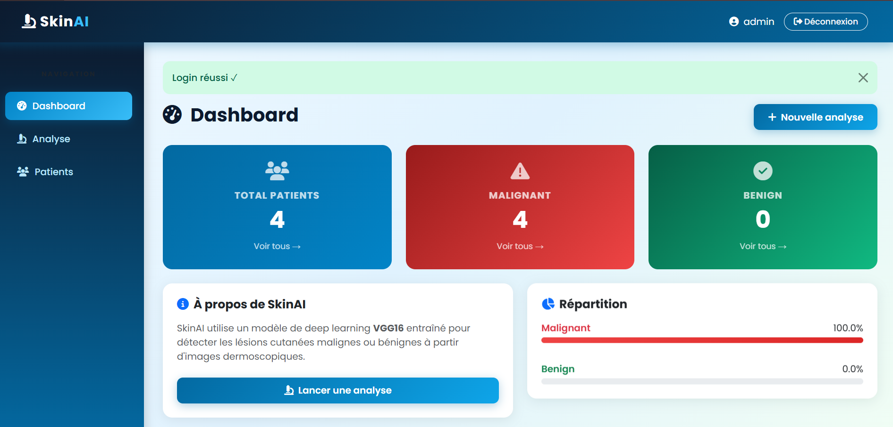
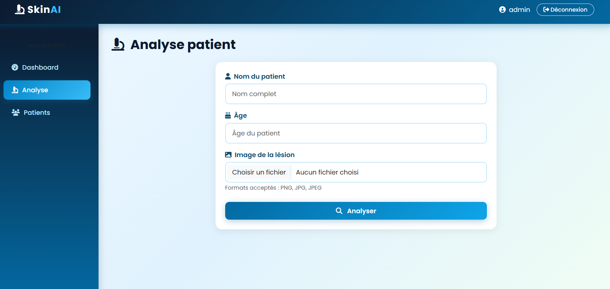
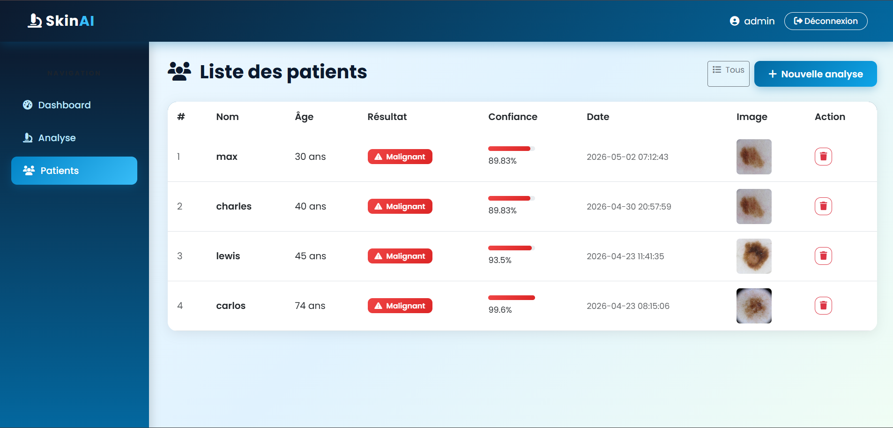
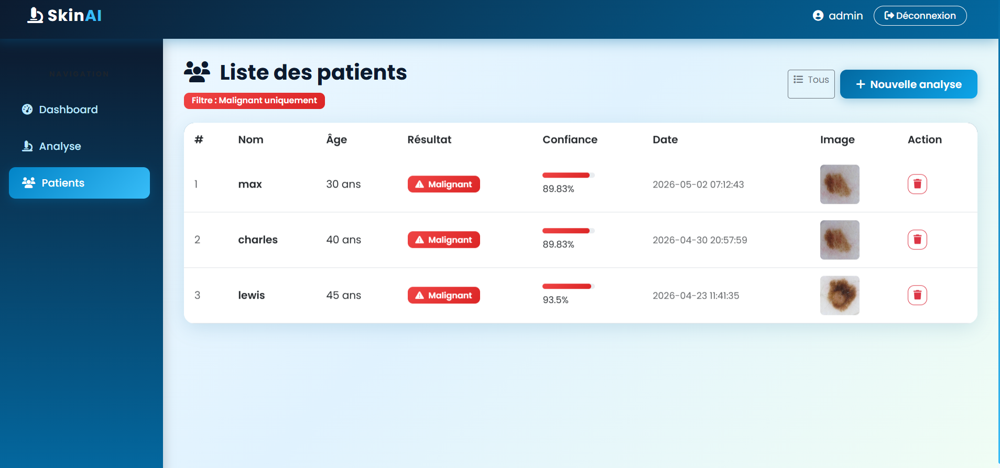
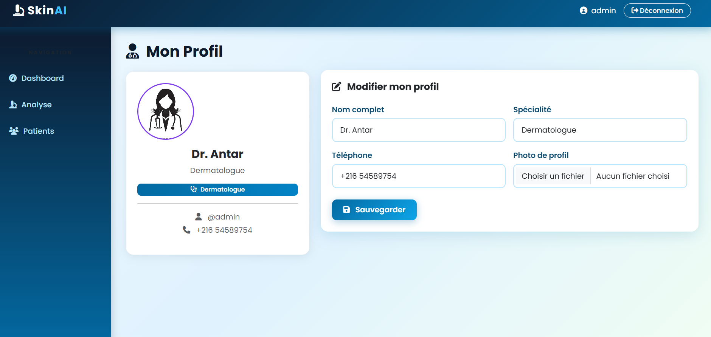

# SkinAI — Skin Cancer Detection Web Application


> A full-stack AI-powered web application for skin lesion classification using deep learning (VGG16 transfer learning), built with Flask and MySQL.

---

## Table of Contents

- [Overview](#overview)
- [Features](#features)
- [AI Model](#ai-model)
- [Tech Stack](#tech-stack)
- [Project Structure](#project-structure)
- [Installation](#installation)
- [Database Setup](#database-setup)
- [Usage](#usage)
- [Demo](#demo)
- [Screenshots](#screenshots)
- [Author](#author)

---

## Overview

**SkinAI** is a medical web application designed to assist healthcare professionals in the early detection of skin cancer. By uploading a dermoscopic image of a skin lesion, the system predicts whether the lesion is **Malignant** or **Benign** using a deep learning model based on **VGG16 transfer learning**.

The application includes:
- Secure doctor authentication
- Patient management system
- AI-powered image analysis
- Real-time statistics dashboard
- Doctor profile management

---

## Features

| Feature | Description |
|---|---|
| **Authentication** | Secure login system with session management |
| **AI Prediction** | VGG16-based skin lesion classification |
| **Dashboard** | Real-time statistics with Malignant/Benign distribution |
| **Patient Management** | Full CRUD — add, view, filter, and delete patients |
| **Image Viewer** | Click-to-enlarge patient images with modal popup |
| **Doctor Profile** | Editable profile with photo upload |
| **Responsive Design** | Clean medical-themed UI built with Bootstrap 5 |
| **Smart Filtering** | Filter patients by diagnosis result from dashboard |

---

## AI Model

### Architecture: VGG16 Transfer Learning

The classification model is built on top of **VGG16**, a convolutional neural network pre-trained on ImageNet, fine-tuned for binary skin lesion classification.

```
Input Image (224×224×3)
        ↓
VGG16 Base (pre-trained, frozen layers)
        ↓
Global Average Pooling
        ↓
Dense (256, ReLU) + Dropout(0.5)
        ↓
Dense (1, Sigmoid)
        ↓
Output: Malignant (>0.5) / Benign (≤0.5)
```

### Dataset

The model was trained on dermoscopic skin lesion images. Each image was:
- Resized to **224×224 pixels**
- Normalized to **[0, 1]** pixel range
- Augmented with rotation, flipping, and zoom

### Preprocessing Pipeline

```python
img = image.load_img(path, target_size=(224, 224))
img = image.img_to_array(img) / 255.0
img = np.expand_dims(img, axis=0)
prediction = model.predict(img)[0][0]
result = "Malignant" if prediction > 0.5 else "Benign"
```

### Model File

```
model/
└── vgg16_malignant_vs_benign.h5   ← Trained Keras model
```

> The `.h5` model file is not included in this repository due to size.
> **Download the model here:** [Google Drive – vgg16_malignant_vs_benign.h5](https://drive.google.com/file/d/15Kp3xsXA7gxOrFAKzrVl4xIXp8e1GB6o/view?usp=drive_link)
> After downloading, place it in the `model/` directory.

---

## Tech Stack

### Backend
| Technology | Version | Role |
|---|---|---|
| Python | 3.11 | Core language |
| Flask | 3.1 | Web framework |
| TensorFlow/Keras | 2.x | Deep learning inference |
| MySQL Connector | Latest | Database driver |
| Werkzeug | Latest | File handling & security |
| Pillow | 12.x | Image processing |

### Frontend
| Technology | Role |
|---|---|
| HTML5 / CSS3 | Structure & styling |
| Bootstrap 5.3 | Responsive layout & components |
| Font Awesome 6.4 | Icons |
| Google Fonts (Poppins) | Typography |
| Vanilla JavaScript | Modal interactions |

### Database
| Technology | Role |
|---|---|
| MySQL (via XAMPP) | Data persistence |
| phpMyAdmin | Database management |

---

## Project Structure

```
SKIN_CANCER_APP/
│
├── app.py                          ← Main Flask application
│
├── model/
│   └── vgg16_malignant_vs_benign.h5  ← AI model (not included)
│
├── static/
│   ├── style.css                   ← Custom medical-themed CSS
│   └── uploads/                    ← Uploaded patient images
│
├── templates/
│   ├── base.html                   ← Base layout (navbar + sidebar)
│   ├── login.html                  ← Authentication page
│   ├── dashboard.html              ← Statistics dashboard
│   ├── predict.html                ← Patient analysis form
│   ├── result.html                 ← Prediction result page
│   ├── patients.html               ← Patient list with filtering
│   └── profile.html                ← Doctor profile page
│
├── assets/
│   ├── demo1.gif                   ← Demo part 1
│   ├── demo2.gif                   ← Demo part 2
│   └── screenshots/                ← App screenshots
│
├── venv/                           ← Python virtual environment
└── requirements.txt                ← Python dependencies
```

---

## Installation

### Prerequisites

- Python 3.11
- XAMPP (Apache + MySQL)
- Git

### Step 1 — Clone the repository

```bash
git clone https://github.com/LinaAntar/skin-cancer-app.git
cd skin-cancer-app
```

### Step 2 — Create virtual environment

```bash
python -m venv venv
venv\Scripts\activate        # Windows
source venv/bin/activate     # macOS/Linux
```

### Step 3 — Install dependencies

```bash
pip install flask tensorflow mysql-connector-python werkzeug Pillow
```

### Step 4 — Add the AI model

Place your trained model file in:
```
model/vgg16_malignant_vs_benign.h5
```

### Step 5 — Start XAMPP

Start **Apache** and **MySQL** from XAMPP Control Panel.

> If port 443 is in use, change it to `4433` in `C:\xampp\apache\conf\extra\httpd-ssl.conf`

---

## Database Setup

Open **phpMyAdmin** at `http://localhost/phpmyadmin` and run:

```sql
CREATE DATABASE skin_cancer_db;
USE skin_cancer_db;

CREATE TABLE users (
    id INT AUTO_INCREMENT PRIMARY KEY,
    username VARCHAR(50),
    password VARCHAR(255),
    full_name VARCHAR(100) DEFAULT 'Dr. Admin',
    specialty VARCHAR(100) DEFAULT 'Dermatologue',
    phone VARCHAR(20) DEFAULT '',
    photo VARCHAR(255) DEFAULT ''
);

CREATE TABLE patients (
    id INT AUTO_INCREMENT PRIMARY KEY,
    name VARCHAR(100),
    age INT,
    result VARCHAR(20),
    probability FLOAT,
    image_path VARCHAR(255),
    created_at TIMESTAMP DEFAULT CURRENT_TIMESTAMP
);

INSERT INTO users (username, password) VALUES ('admin', '1234');
```

---

## Usage

### Start the application

```bash
# Activate virtual environment
venv\Scripts\activate

# Run Flask app
python app.py
```

### Access the app

Open your browser and go to:
```
http://127.0.0.1:5000
```

### Login credentials

| Field | Value |
|---|---|
| Username | `admin` |
| Password | `1234` |

### Workflow

```
Login → Dashboard → New Analysis → Upload Image → View Result → Patient List
```

---

## Demo





---

## Screenshots

### Login


### Dashboard


### Patient Analysis


### Patient List


### Filter — Malignant only


### Doctor Profile


---

## Security Notes

> This project is developed for **academic purposes**. For production deployment:
> - Hash passwords using `werkzeug.security.generate_password_hash`
> - Use environment variables for sensitive configuration
> - Deploy with a production WSGI server (Gunicorn/uWSGI)
> - Enable HTTPS

---

## Author

**Lina Antar**

Student — Ingénierie en Technologies Avancées
ENSTA Borj-Cédria

---

## License

This project is for academic use only.

---

<div align="center">
  <sub>Built with love using Flask, TensorFlow & Bootstrap</sub>
</div>
